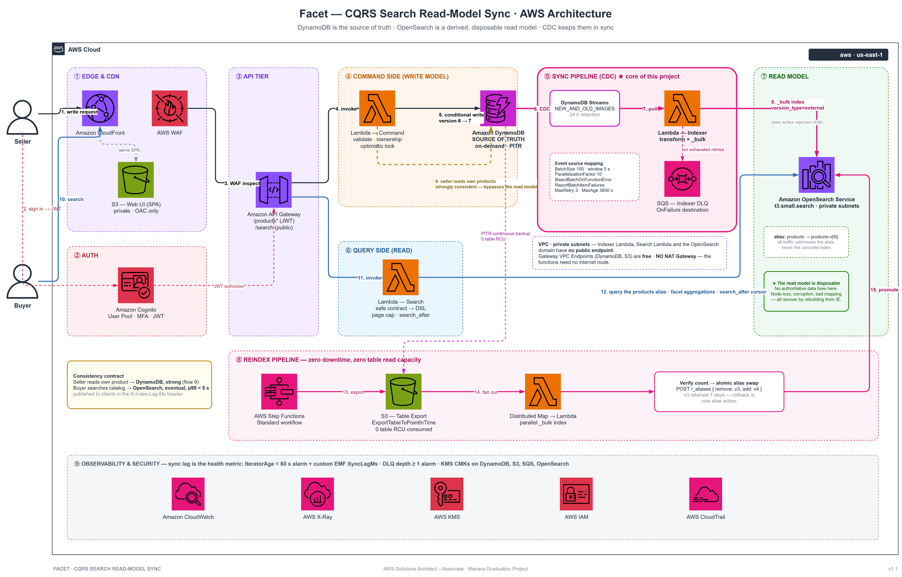

# Facet — CQRS Search Read-Model Sync on AWS

**A product catalog search platform that keeps a DynamoDB write model and an OpenSearch read model consistent, correct, and rebuildable.**

*AWS Solutions Architect – Associate graduation project · Manara*



---

## Table of contents

| # | Section | Deep dive |
|---|---|---|
| 1 | [Solution overview](#1-solution-overview) | — |
| 2 | [Architecture](#2-architecture) | [02-architecture.md](./docs/02-architecture.md) |
| 3 | [Request flows](#3-request-flows) | — |
| 4 | [Requirements & scale anchor](#4-requirements--scale-anchor) | [01-requirements.md](./docs/01-requirements.md) |
| 5 | [Design decisions](#5-design-decisions) ⭐ | [03-design-decisions.md](./docs/03-design-decisions.md) |
| 6 | [Well-Architected Framework](#6-well-architected-framework) | [04-well-architected.md](./docs/04-well-architected.md) |
| 7 | [Cost](#7-cost) | [08-cost-estimate.md](./docs/08-cost-estimate.md) |
| 8 | [Security](#8-security) | — |
| 9 | [Risks](#9-risks) | [05-risks.md](./docs/05-risks.md) |
| 10 | [Future work](#10-future-work) | [06-future-work.md](./docs/06-future-work.md) |
| 11 | [Repository structure](#11-repository-structure) | [07-appendix.md](./docs/07-appendix.md) |

---

## 1. Solution overview

### The problem

A marketplace stores 2 million products in Amazon DynamoDB. DynamoDB serves point reads
and seller-scoped listings in single-digit milliseconds at any scale — but it cannot
answer the query buyers actually type:

> *"Laptops · under 20,000 EGP · rating above 4 · in stock · sorted by price · and show me
> how many results fall in each brand and price band."*

That needs full-text relevance, arbitrary multi-attribute filtering, sorting on non-key
attributes, and aggregations. DynamoDB provides none of them, and this is not a tuning
problem. A `Query` requires a known partition key. A `Scan` with a filter reads the whole
table and pays for every item it examines. Each Global Secondary Index buys exactly **one**
more access pattern — with five freely-combinable filter attributes the useful permutations
outgrow the 20-GSI quota, and none of them produce relevance ranking or facet counts anyway.

### The solution

**CQRS.** DynamoDB stays the authoritative write model. A derived OpenSearch read model is
kept in sync by Change Data Capture over DynamoDB Streams.

Standing up OpenSearch is the easy part. The engineering is in the sync:

| The hard problem | How Facet answers it |
|---|---|
| Two stores, no distributed transaction | **No dual-write.** DynamoDB Streams is the only path to the index — the application physically cannot write to both. |
| A stale update overwriting a fresh one | **External versioning.** OpenSearch rejects any document version not strictly greater, atomically and server-side. |
| One malformed record halting an ordered shard | **Partial batch response + bisect + bounded retries + DLQ.** The shard never stalls; nothing is dropped silently. |
| Rebuilding 2 M documents without breaking search | **S3 Export → parallel bulk index → atomic alias swap.** Zero downtime, zero table read capacity consumed. |
| Users not seeing their own writes | **Route reads by audience.** Sellers read DynamoDB (strong); buyers search OpenSearch (eventual, p95 < 5 s). |

### The property that makes it all work

> **The read model is disposable.**

OpenSearch holds no authoritative data. Node loss, index corruption, a bad mapping, a
transform bug — every one of them collapses into the same recovery: run the reindex
pipeline. That single property is what makes a single-node search cluster a defensible
choice rather than a hidden single point of failure, and it is why the reliability argument
in this design is architectural rather than aspirational.

---

## 2. Architecture

Facet is split down the middle. Each half is optimised for one job, and a CDC pipeline
joins them.

```
                    ┌──────────────── COMMAND SIDE ────────────────┐
   Sellers ────────►│  API → Lambda → DynamoDB (source of truth)   │
                    └──────────────────────┬───────────────────────┘
                                           │
                                  DynamoDB Streams (CDC)
                                           │
                    ┌──────────────────────▼───────────────────────┐
                    │  SYNC — Indexer Lambda → OpenSearch _bulk     │
                    │  external versioning · bisect · DLQ           │
                    └──────────────────────┬───────────────────────┘
                                           │
                    ┌──────────────────────▼───────────────────────┐
   Buyers  ────────►│  API → Lambda → OpenSearch (read model)      │
                    └──────────────── QUERY SIDE ──────────────────┘
```

### Components

| Group | Services | Role |
|---|---|---|
| **① Edge** | CloudFront · WAF · S3 (SPA) | Single public entry point. Managed rule groups and a rate-based rule stop abuse before it can reach a Lambda — or an expensive OpenSearch query. Popular anonymous searches are cached at the edge. |
| **② Auth** | Cognito User Pool | Seller sign-up, sign-in, MFA. API Gateway validates the JWT before any function runs. Buyer search is public, protected by WAF rather than tokens. |
| **③ Command** | API Gateway · Command Lambda · **DynamoDB** | Validates, checks ownership, and writes with an optimistic-locking `ConditionExpression` on a monotonic `version`. On-demand billing, PITR enabled, stream set to `NEW_AND_OLD_IMAGES`. |
| **④ Sync** ⭐ | DynamoDB Streams · Indexer Lambda · SQS DLQ | The heart of the project. Transforms items into search documents and bulk-indexes them with external versioning. Every event-source-mapping parameter defends a specific failure mode. |
| **⑤ Query** | Search Lambda · **OpenSearch** | Translates a constrained public contract into OpenSearch DSL. The domain sits in private subnets and is addressed only through the `products` **alias**. |
| **⑥ Reindex** | Step Functions · S3 Export | Export → build `products-v{N}` → verify → atomic alias swap. The runbook for every read-model failure. |
| **⑦ Cross-cutting** | CloudWatch · X-Ray · KMS · IAM · CloudTrail | Sync lag is the health metric and is measured two ways. Least-privilege role per function. CMK encryption at rest throughout. |

### The sync pipeline, configured deliberately

Every line below is a decision, not a default:

```yaml
BatchSize:                      100      # one _bulk request per invocation
MaximumBatchingWindowInSeconds: 5        # fewer invocations at low write rates
ParallelizationFactor:          10       # drains the 5,000/min bulk-import burst
BisectBatchOnFunctionError:     true     # binary-search the poison record
MaximumRetryAttempts:           3        # bounded retries
MaximumRecordAgeInSeconds:      3600     # no record retried forever
FunctionResponseTypes:          [ ReportBatchItemFailures ]   # partial batch response
DestinationConfig.OnFailure:    IndexerDLQ                    # nothing dropped silently
```

Indexing uses **external versioning**, reusing the write model's optimistic-locking
version as the read model's ordering key:

```json
{ "index": { "_index": "products", "_id": "a1b2c3",
             "version": 7, "version_type": "external" } }
```

A `409 version_conflict` therefore means *"a newer version already landed"* — an expected
outcome, counted as a metric, never routed to the DLQ.

---

## 3. Request flows

**A · Write and propagate**

```
1. Seller → CloudFront → WAF → API Gateway (Cognito JWT)
2.        → Command Lambda
3.        → DynamoDB conditional write (version 6 → 7)  ── 200 returned here
   ────────────────── the seller's request ends ──────────────────
4. DynamoDB Streams emits NEW_AND_OLD_IMAGES
5.        → Indexer Lambda (≤100 records, ≤5 s window)
6.        → transform → OpenSearch _bulk, version=7, version_type=external
7.        → emit SyncLagMs           Buyer-visible within p95 5 s.
```

**B · Search**

```
1. Buyer → CloudFront (edge cache) → WAF → API Gateway
2.       → Search Lambda (in VPC)
3.       → validate + translate to DSL (bounded page size, search_after)
4.       → query the `products` alias
5.       → hits + facet aggregations, X-Index-Lag-Ms header
```

**C · Seller reads own catalog — bypasses the read model**

```
1. Seller → API Gateway (JWT) → Command Lambda
2.        → DynamoDB GetItem (strongly consistent) / GSI1 Query
   No OpenSearch. Sellers never see their own stale data.
```

**D · Poison record**

```
5. Indexer fails on 1 malformed record in a batch of 100
6. ReportBatchItemFailures returns only that sequence number — 99 committed
7. BisectBatchOnFunctionError isolates the offender
8. After 3 attempts → Indexer DLQ → alarm at depth ≥ 1
   The shard never stalls.
```

**E · Zero-downtime reindex**

```
1. Admin / schedule → Step Functions
2. ExportTableToPointInTime → S3          (0 table RCU consumed)
3. Create products-v4 with the versioned mapping
4. Distributed Map over export shards → _bulk index
5. Verify document count against the manifest
6. POST /_aliases  { remove: v3, add: v4 }   ← atomic
7. Retain v3 for 7 days — rollback is one alias action
```

---

## 4. Requirements & scale anchor

Full detail in [01-requirements.md](./docs/01-requirements.md).

### Service level objectives

| Target | Value | Measured by |
|---|---|---|
| Search latency | p95 < 300 ms | API Gateway `Latency` |
| Write latency | p95 < 150 ms | API Gateway `Latency` |
| **Sync lag** | **p95 < 5 s, p99 < 30 s** | `SyncLagMs` (EMF) + `IteratorAge` |
| Full reindex | 2 M docs < 30 min, zero search downtime | Step Functions duration |

### The consistency contract — stated, not assumed

| Read | Store | Consistency |
|---|---|---|
| Seller reads own product | DynamoDB | **Strong** |
| Seller lists own products | DynamoDB GSI1 | Eventual, sub-second |
| Buyer searches catalog | OpenSearch | **Eventual, p95 < 5 s** — published in `X-Index-Lag-Ms` |

### Scale anchor

Every decision in this document is justified against these numbers.

| Signal | Number | What it drives |
|---|---|---|
| Products | 2,000,000 | ~4 GB index — fits one small node |
| Writes (steady / burst) | ~500/min / ~5,000/min | `ParallelizationFactor: 10` |
| Searches (peak) | 200 req/s | Documented production topology |
| Document size | ~2 KB | `BatchSize: 100` ≈ 200 KB per bulk request |
| **Stream retention** | **24 h (fixed)** | Makes the reindex pipeline mandatory, not optional |

### Out of scope

Multi-region active-active · ML-personalised ranking · transactional inventory
reservation · payments and checkout · per-locale index-per-language.
Stated so the design is not judged against goals it never had.

---

## 5. Design decisions

The full **Options / Choice / Rationale** treatment of all fourteen decisions is in
[03-design-decisions.md](./docs/03-design-decisions.md). Summary:

| # | Decision | Chose | Rejected, and why |
|---|---|---|---|
| 3.1 | Single store vs CQRS | **CQRS** | GSIs buy one access pattern each and never produce facets; Aurora full-text means running a DB 24/7 for a scale-to-zero workload |
| 3.2 ⭐ | Dual-write vs CDC | **DynamoDB Streams** | Dual-write has no atomicity — a failed second write corrupts the index with **nothing recording that it happened**. Outbox is redundant: Streams *is* the outbox |
| 3.3 | DDB Streams vs Kinesis | **DDB Streams** | Kinesis-for-DynamoDB gives no ordering guarantee and may duplicate. One consumer needed; 24 h retention covered by reindex |
| 3.4 | Zero-ETL vs custom indexer | **Custom Lambda** | Need field allow-listing, derived facets, denormalisation, and version control — Zero-ETL fits 1:1 mappings, not this |
| 3.5 ⭐ | Out-of-order updates | **External versioning** | LWW silently corrupts; read-then-compare is a check-then-act race. `ParallelizationFactor > 1` and bisect make stale-after-fresh **normal**, not theoretical |
| 3.6 ⭐ | Poison records | **Partial batch + bisect + DLQ** | Failing the batch stalls the shard until retention expires; swallowing converts a loud failure into a silent one |
| 3.7 ⭐ | Serverless vs provisioned search | **`t3.small.search`** | Serverless bills a minimum OCU floor at zero traffic — a cost no architectural change can remove |
| 3.8 | Public vs VPC domain | **VPC, no NAT** | Public search endpoints are a top data-leak source. Gateway endpoints are free — the ~\$32/mo NAT is avoided deliberately |
| 3.9 ⭐ | Scan vs S3 Export for reindex | **S3 Export** | `Scan` consumes read capacity and throttles production; Export reads from PITR backups at **zero table RCU** |
| 3.10 | In-place vs alias swap | **Alias swap** | In-place reindex means minutes of broken search and no abort; the swap is atomic with 7-day rollback |
| 3.11 ⭐ | Read-your-writes | **Route by audience** | Blocking on index couples write latency to cluster health; polling pushes internals to clients |
| 3.12 | Direct integration vs Search Lambda | **Lambda** | Raw DSL is a DoS vector (deep pagination, unbounded aggregations) and an exfiltration vector |
| 3.13 | Hard vs soft delete | **Soft delete** | A `REMOVE` event carries no version, so deletes escape the ordering guarantee and a product can resurrect |
| 3.14 | `from`/`size` vs `search_after` | **`search_after`** | Offset pagination fails past `max_result_window` and drifts on a live index |

---

## 6. Well-Architected Framework

Full mapping in [04-well-architected.md](./docs/04-well-architected.md).

| Pillar | Highlights |
|---|---|
| **Operational Excellence** | Sync lag measured two ways (`IteratorAge` + `SyncLagMs`) because latency and errors alone never reveal a silently drifting read model. Mappings in version control. The reindex pipeline *is* the runbook — one tested execution with documented rollback. |
| **Security** | No public data stores. WAF at the edge. The read model is treated as a **publication surface**: the indexer projects an allow-list, so a new sensitive attribute is excluded by default. Clients never see the datastore's query language. CMK encryption at rest, TLS and node-to-node in transit, least-privilege role per function. |
| **Reliability** | **The read model is disposable** — every read-model failure has one recovery. Graceful degradation: losing search does not lose the catalog. No dual-write. Poison records cannot stall a shard. Stale writes cannot corrupt a document. Nothing is dropped silently. |
| **Performance Efficiency** | Right store per access pattern. Facet buckets precomputed at write time (8/s) instead of read time (200/s). `search_after` costs the same on page 500 as page 1. Stream consumption tuned for the documented burst. |
| **Cost Optimization** | Serverless rejected where it costs more and chosen where it costs less. **No NAT Gateway** — the single largest line item on a demo bill, structurally absent. Reindex consumes zero table capacity. Full [cost estimate](./docs/08-cost-estimate.md) published, including the charges that are *not* free. |
| **Sustainability** | Scale-to-zero compute; one deliberately right-sized always-on node. Batching cuts invocation count ~100× at burst. TTL purges soft-deleted items; superseded indices deleted after the rollback window. Single region — no idle standby infrastructure. |

---

## 7. Cost

Approximate `us-east-1` list prices. Full breakdown and guardrails in
[08-cost-estimate.md](./docs/08-cost-estimate.md).

| | Demo | At scale anchor (50 M searches/mo) |
|---|---:|---:|
| OpenSearch `t3.small.search` | \$0 *(Free Tier, 12 mo)* | \$27.50 |
| AWS WAF | \$8 | \$38 |
| CloudFront | \$0 | \$30 |
| API Gateway | \$0 | \$60 |
| Lambda · DynamoDB · Streams | \$0 | \$20 |
| KMS · CloudWatch · X-Ray · S3 · SQS · Step Functions | \$4 | \$16 |
| **NAT Gateway** | **\$0 — not provisioned** | **\$0** |
| **Total** | **≈ \$12 / month** | **≈ \$192 / month** |

Three decisions shape this bill: **no NAT Gateway** (~\$32/mo/AZ avoided), **provisioned
search over Serverless** (avoids an unoptimisable OCU floor), and **S3 Export over Scan**
(reindex cost does not scale with table size). AWS WAF is the one unavoidable standing
charge, and it is stated rather than hidden.

Cost is dominated by per-request edge and API charges, not by the datastores — so the
highest-leverage optimisation is raising the cache hit ratio, not resizing the cluster.

---

## 8. Security

| Layer | Control |
|---|---|
| **Network** | OpenSearch in private subnets with **no public endpoint**. S3 buckets private, reachable only via CloudFront OAC. Lambdas have **no internet route** — free Gateway VPC Endpoints reach DynamoDB and S3. |
| **Edge** | WAF managed rule groups (Core Rule Set, Known Bad Inputs) + rate-based rule, evaluated before any compute runs. |
| **Identity** | Cognito User Pool with MFA; API Gateway validates the JWT. Write handlers separately verify product ownership — authentication is not authorisation. |
| **Data exposure** | The indexer projects an explicit **allow-list**. `costPrice`, `margin`, and internal notes are structurally incapable of reaching an index that serves anonymous buyers. `_source` filtering is the second layer; a CI schema test is the third. |
| **Query surface** | Clients send a constrained contract, never DSL. Page size, page depth, aggregations, and query timeout are all capped server-side. |
| **Encryption** | KMS customer-managed keys on DynamoDB, S3, SQS, and the OpenSearch domain. TLS on every hop; node-to-node encryption and `enforce_https` on the domain. |
| **Least privilege** | One IAM role per function. The Search Lambda holds read-only OpenSearch permissions on the search path — it cannot write to the index. Fine-grained access control maps roles to index-level permissions. |
| **Audit** | Multi-region CloudTrail with log-file integrity validation. |

---

## 9. Risks

Full register with likelihood, impact, and mitigations in [05-risks.md](./docs/05-risks.md).

| Risk | Impact | Mitigation |
|---|---|---|
| **Poison record stalls a shard** | High | Partial batch response, bisect, bounded retries, DLQ + alarm |
| **Out-of-order update corrupts a document** | High | External versioning — silent corruption becomes a counted `409` |
| **⭐ Pipeline outage > 24 h** (stream retention is fixed) | High | The reason the reindex pipeline exists. `IteratorAge` alarms at 60 s, leaving ~23 h of margin |
| **Bad reindex promoted** | High | Count verification before swap; 7-day retained index; one-action rollback |
| **Internal fields leak to the public index** | High | Indexer allow-list — new attributes excluded by default; `_source` filtering; CI schema test |
| **Sync lag spike during bulk import** | Medium | `ParallelizationFactor: 10`; bounded, self-healing, alarmed |
| **Single-AZ node loss** | Medium | **Accepted.** Search degrades, catalog does not. Recovery = one reindex |
| **Deep-pagination / aggregation abuse** | Medium | `search_after`, page-depth cap, aggregation allow-list, WAF rate limiting |

**Accepted knowingly:** single-AZ search · eventual consistency for buyers · single region
· at-least-once indexing (idempotent by `_id` + external versioning).

---

## 10. Future work

Each item carries the trigger that would make it worth doing — see
[06-future-work.md](./docs/06-future-work.md).

- **Kinesis Data Streams** when a third stream consumer appears (2-consumer ceiling)
- **OpenSearch Serverless** once traffic is continuous and the OCU floor stops being dead weight
- **Autocomplete** as a separate index when type-ahead needs sub-50 ms
- **Semantic search** with k-NN vectors — after measurable recall loss, not before
- **Scoped partial reindex** by seller or category, instead of a full rebuild
- **Multi-region** read replicas — Global Tables for the write model, a *locally derived* index per region
- **Search analytics** — zero-result rate is the most actionable metric and nearly free to capture
- **Quality-gated index promotion** — golden-query set validated before the alias swap

---

## 11. Repository structure

```
facet-cqrs-aws/
├── README.md                       this document
├── diagram/
│   ├── architecture.png            solution architecture diagram
│   ├── architecture.drawio         editable source (draw.io)
│   └── README.md                   how to edit and export
└── docs/
    ├── 01-requirements.md          functional, non-functional, scale anchor, out of scope
    ├── 02-architecture.md          components and request flows
    ├── 03-design-decisions.md   ⭐ 14 decisions — Options / Choice / Rationale
    ├── 04-well-architected.md      six-pillar mapping
    ├── 05-risks.md                 risk register + explicitly accepted risks
    ├── 06-future-work.md           v2 items, each with a trigger
    ├── 07-appendix.md              service inventory, API contract, index mapping,
    │                               alarms, runbooks, production topology, deployment
    └── 08-cost-estimate.md         demo vs scale-anchor cost, guardrails
```

---

<sub>AWS Solutions Architect – Associate graduation project · Manara</sub>
